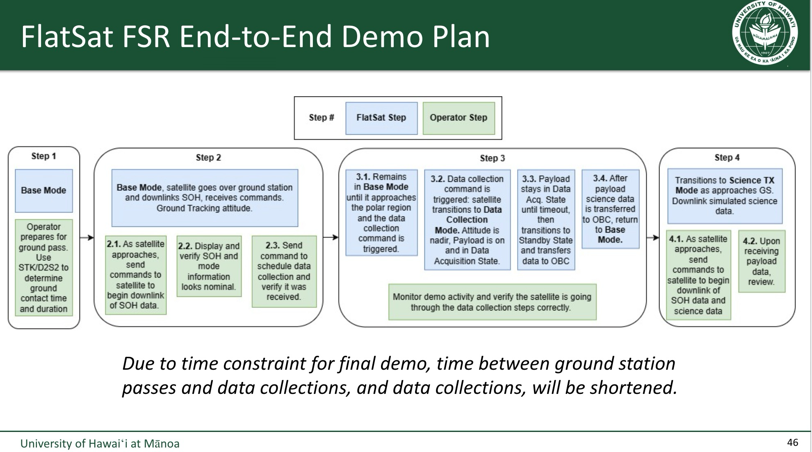

# fprime-artemis-cubesat

F' implementation workspace for the Neutron 2 team.

## What this project is

This repository is building the Neutron 2 FlatSat demo on Artemis prototype
hardware.

- **Satellite Raspberry Pi:** runs the F' flight-software deployment
  (`ArtemisRpiTeensy_N2`). This is the mission brain: modes, commands,
  telemetry, payload collection orchestration, storage, and science downlink
  requests.
- **Satellite Teensy:** runs baremetal bridge/control firmware
  (`ArtemisTeensy_N2_Baremetal`). This handles the microcontroller-side
  subsystem/radio work: the single Pi UART, local subsystem RPC such as EPS/PDU,
  and the RFM23BP link.
- **Ground Teensy:** runs baremetal RF/USB bridge firmware (`GDS_Teensy`). It
  reassembles RF packets to laptop USB streams and packetizes uplink bytes back
  over RF.
- **Ground laptop:** uses `fprime-gds` for the current MVP command, event, and
  telemetry surface, plus the Neutron 2 payload viewer for reconstructed science
  files.

## Hardware test bench stack

This section describes the physical hardware that makes up the current Neutron 2
test bench, written for students and new team members so the hardware context
behind the software is clear. The prototype is based on the
[Artemis CubeSat Kit](https://sites.google.com/hawaii.edu/artemiscubesatkit).

The bench is intentionally a **two-node mirror**: the ground station and the
satellite are built from the same kitted hardware. This keeps the radio code and
bring-up procedure identical on both ends.

### Two identical nodes: ground station and satellite

Both the ground station and the satellite are built on the same OBC (On-Board
Computer) board and carry the same compute and radio kit:

| Item | Detail |
|------|--------|
| OBC board | Version 4.23 (both nodes) |
| Microcontroller | Teensy 4.1 |
| Single-board computer | Raspberry Pi Zero W |
| Radio | RFM23BP (RFM23BP transceiver / radio head) |
| Antenna | Antenna board with good (non-rusty) antennas |

So the bench is **two OBC boards**, each kitted with a Teensy 4.1 and a Raspberry
Pi Zero W — one acting as the **ground station**, the other as the **satellite**.

Roles inside each node:

- The **Raspberry Pi Zero W** runs the higher-level software (on the satellite,
  the F Prime flight-software deployment).
- The **Teensy 4.1** is required to interface with the **RFM23BP** radio — it
  drives the radio head and the RF link.
- The **antenna board** carries the antennas for the RF link.

That is the whole RF path on each node: Pi <-> Teensy 4.1 <-> RFM23BP <-> antenna.

### Power / EPS hardware

What we have on hand:

- **PDU:** Version 2.2.
- **Battery board:** Version 2.

**Current power reality:** so far we have **only tested USB-powered** OBC/Teensy
on both the ground station and the satellite. The PDU, battery board, and solar
panels are not yet integrated into the bring-up.

**Eventually** we want to power the bench from the real bus: bring up the
**PDU** and **battery board**, and maybe **solar panels** — i.e. use the entire
[Artemis CubeSat Kit](https://sites.google.com/hawaii.edu/artemiscubesatkit) bus
instead of USB power.

### Future direction: stay on the RFM23BP radio head for now

A longer-term option is to move the ground station **away from a carbon-copy of
the satellite** and toward a **Software Defined Radio (SDR)**. We are
intentionally **not** doing that right now.

Reasons to stay on the current RFM23BP radio for now:

- **Lower maintenance:** Going SDR means someone has to learn and maintain the
  SDR stack, and effectively relearn how RF comms works at a lower level.
- **Code reuse:** Keeping the same RFM23BP radio head lets us reuse the existing
  RadioHead-library-based radio code on both nodes instead of rewriting the link
  layer.
- **Two identical nodes are simpler:** Building the ground station from the same
  kit as the satellite means one bring-up procedure and one radio codebase.

In short: an SDR is a "someday" upgrade, not a near-term need. Until the benefit
clearly outweighs the added learning and maintenance burden, we keep the
RFM23BP + RadioHead path on both the ground station and the satellite. See
[`docs/archive/HACKRF_SDR_GROUND_STATION_INVESTIGATION_2026-06-30.md`](docs/archive/HACKRF_SDR_GROUND_STATION_INVESTIGATION_2026-06-30.md)
for the HackRF/SDR packet-compatibility investigation.

## Target demo



The current target is a shortened FlatSat FSR end-to-end demo based on the team's system diagram and operator flow. The live demo is not a full mission implementation; it is a controlled proof-of-concept showing command, telemetry, timed data collection, and science-data downlink across the full Raspberry Pi -> satellite Teensy -> RF -> ground Teensy -> ground station chain.

### Target operator story

1. Boot the system into `Base Mode`.
2. On the ground side, use `D2S2` pass-planning inputs to determine the mock ground-contact window and duration for the demo.
3. As the demo "pass" starts, command the vehicle to downlink `SOH`/base-mode telemetry and show live health/status data to judges on the ground display.
4. While still in base mode, send a command that schedules a short data-collection action, for example `10` seconds from now.
5. Trigger the data-collection script/command using simulated or temporary payload data if real payload integration is not ready.
6. After collection completes, transition to a science-data transmit path and downlink the collected payload/science data.
7. On the ground PC, use `fprime-gds` for command/event/telemetry visibility and the Neutron 2 payload viewer for visual review of the downlinked science data. Longer term, the end-goal ground presentation stack is `Yamcs` or another mission-control style analysis/display tool.

### Demo scope assumptions

- Demo timings are intentionally compressed relative to a real pass so the full flow fits into a live presentation window.
- `Base Mode`, data collection, and science downlink are the required user-visible states.
- Simulated payload data is acceptable until a real payload data source is stable enough for the demo.
- Ground-station presentation quality matters: live telemetry, command acknowledgement, and visible science-data review are part of the success criteria.

## MVP Demo Release Freeze

GitHub release: `v1.0.0`

Internal demo-freeze label: `v1.0.0-mvp-demo`

Release date: 2026-07-02

Purpose: freeze the known-good Neutron 2 FlatSat MVP demo state so the team has
one reproducible version for sharing, flashing, rehearsal, and regression
comparison. This is a demo release, not a flight-readiness claim.

Frozen artifact set:

- Pi Zero W F Prime binary:
  `ArtemisRpiTeensy_N2/build-artifacts/pi-zero-w-armv6hf/ArtemisRpiTeensyDeployment/bin/ArtemisRpiTeensyDeployment`
- Matching F Prime dictionary:
  `ArtemisRpiTeensy_N2/build-artifacts/pi-zero-w-armv6hf/ArtemisRpiTeensyDeployment/dict/ArtemisRpiTeensyDeploymentTopologyDictionary.json`
- Satellite Teensy firmware:
  `ArtemisTeensy_N2_Baremetal/build/arduino-cli/satellite_teensy.ino.hex`
- Ground Teensy firmware:
  `GDS_Teensy/build/arduino-cli/gds_teensy.ino.hex`
- GitHub Release checksum file:
  `SHA256SUMS`

Validation gates for this release:

- `tools/validate_local.sh`
- unified-topology F Prime generate/build
- Pi Zero W ARMv6 cross-build or existing artifact verification
- satellite Teensy Arduino CLI build
- ground Teensy Arduino CLI build
- release-asset checksum generation

Hardware proof basis:

- The live HIL path has been demonstrated with GDS command/event/telemetry over
  RF, Raspberry Pi runtime on `/dev/serial0`, operator-scheduled collection,
  simulated payload capture, channel-1 payload reconstruction, payload viewer
  parsing, and Pi-vs-ground payload hash matching.
- The runbook source of truth for reproducing the demo is
  [`docs/NEUTRON2_RF_MVP_DEMO_RUNBOOK.md`](docs/NEUTRON2_RF_MVP_DEMO_RUNBOOK.md).

Validated for this MVP:

- laptop GDS to ground Teensy channel 0 path
- RFM23BP command uplink and telemetry/event downlink
- Raspberry Pi Zero W deployment runtime through the satellite Teensy UART
- Base Mode command path and SOH snapshot path
- compressed scheduled collection flow
- simulated Neutron 2 payload capture on the Pi
- storage/downlink handoff events
- channel 1 payload transfer through the RF bridge
- ground-side payload reconstruction with CRC
- payload viewer parsing of reconstructed science bytes

Not validated by this release:

- stock F Prime file downlink for science products
- high-rate telemetry
- production SatNOGS radio behavior
- real Neutron payload board data source
- full mission-duration timing
- channel 2 HIL against the real PDU
- RF/GDS APID sequence-count cleanup and full uplink robustness
- battery/PDU-powered RF brownout behavior
- flight readiness

Post-v1 development should happen on `neutron2-develop`. Student work should
start from that branch, not from the frozen release branch/tag. The
`neutron2-develop` branch currently starts from the same contents as the MVP
release baseline, so it is the right place for follow-on work without changing
the proven demo snapshot.

The 2026-07-06 hardening sprint addressed the laptop-verifiable operational
gaps without changing the frozen release baseline: scheduling/cancel edge
cases, topology de-forking, restart prep, drift checks, parameter persistence,
FPP ops hygiene, Pi provisioning docs, and stale-doc cleanup. The 2026-07-30
RF HIL follow-up superseded whole-MCU Teensy watchdog arming with bounded RF
operations and explicit SDN radio recovery. Remaining follow-up should focus
on ARMv6 cross-build verification, RF power-integrity/SPI bench measurements,
Pi service migration, `PRM_SAVE` round-trip behavior, and PDU/payload hardware
integration.

## F Prime Version

This branch is pinned to F Prime `v4.2.1`:

```bash
git -C ArtemisRpiTeensy_N2/lib/fprime describe --tags --dirty --always --long
```

Use `describe --tags` when checking the framework version. F Prime `v4.2.x` tags
are lightweight tags, so plain `git describe` or parent `git submodule status`
can misleadingly report a `v3.1.1-...` description for the same commit.

## Repository layout

Where to find things:

- `ArtemisRpiTeensy_N2/`
  - Active F' flight-software project (promoted in place from the starter sample).
  - Includes the deployment and custom components such as `MissionApp`, `ScienceApp`, `SoHApp`, `ThermalManager`, `UartChannelMux`, `PayloadDownlinkApp`, `EpsManager`, and `EpsDriver_Artemis`.
  - F Prime framework lives in `ArtemisRpiTeensy_N2/lib/fprime` (pinned submodule).
- `ArtemisTeensy_N2_Baremetal/`
  - Satellite Teensy relay firmware workspace (Arduino CLI workflow).
- `GDS_Teensy/`
  - Ground-station Teensy relay firmware workspace (Arduino CLI workflow).
- `ground-station/neutron2-payload-viewer/`
  - Neutron 2 payload/science viewer used on the ground laptop.
- `student_onboarding/`
  - Standalone student exercises (e.g. `basic_radio_ping_pong`).
- `external/`
  - Vendored reference repos: `artemis-pdu` (PDU firmware/ICD/bench tooling), `payload-neutron-simulation` (simulated payload source), plus `epscorc3m` and `artemis-cubesat-examples` (reference only).
- `config/transport_constants.json`
  - Single source of truth for the UART/RF transport constants.
- `tools/`
  - Repo-level helper scripts (`validate_local.sh`, transport-constant generate/check).
- `docs/`
  - Architecture, runbooks, and integration notes (see [Read next](#read-next)).

## Read next

New here? Read these roughly in order to fully understand the project:

1. `docs/SYSTEM_ARCHITECTURE.md` — current Neutron 2-on-Artemis architecture, the application/manager/driver component model, the RF/transport design, and an end-to-end command/telemetry trace. **Read this first.**
2. `docs/GLOSSARY.md` — every acronym and term used across the repo (SOH, CCSDS, APID, D2S2, OBC, PDU, HAL, ...). Keep it open while reading the rest.
3. `docs/FPRIME_GROUND_INTERFACES_PRIMER.md` — F´ literacy: commands, events, telemetry, and parameters, and how to add each.
4. `docs/archive/OPTIMAL_FPRIME_COMPONENT_TOPOLOGY_PLAN.md` — component and topology plan.
5. `docs/TIME_AND_SCHEDULING.md` — rate groups, the clock, and how the "collect in N seconds" countdown works.
6. `EMULATION.md` and `docs/NEUTRON2_LOCAL_EMULATION_RUNBOOK.md` — laptop-only closed-loop emulation (no hardware).
7. `docs/NEUTRON2_RF_MVP_DEMO_RUNBOOK.md` — the real hardware-in-the-loop (HIL) demo flow.
8. `docs/HARDWARE_PORT_MAP_AND_POWER.md` — which USB/serial device is which, and how to power the bench safely.
9. `docs/MISSION_OPS_QUICK_RUN.md` — one-page local rehearsal and FlatSat/HIL operator checklist.
10. `docs/STUDENT_WINDOWS_LAPTOP_SETUP.md` — Windows laptop setup for student developers and viewer users.
11. `docs/CROSS_COMPILE_PI_ZERO_W_STUDENT_GUIDE.md` and `docs/RPI_BUILD.md` — building the Pi Zero W flight binary (cross-compile preferred; native is the manual fallback).
12. `docs/SOFTWARE_DEBUGGING_TROUBLESHOOTING.md` — where to look first when commands, telemetry, payload downlink, or EPS/PDU behavior fails.
13. `docs/agents_notes.md` — current implementation status and next-agent guidance.
14. `docs/NEUTRON2_DUAL_GDS_RADIO_ADDRESSING.md` — named A/B RF endpoint profiles, isolated F Prime/GDS identities, build/flash commands, and the deferred two-pair qualification matrix.

## Build and run (local emulation)

This section covers the **local laptop emulation** build/run loop (no flight
hardware). For the full hardware run, see
[Hardware-in-the-loop (HIL) testing](#hardware-in-the-loop-hil-testing) below.

For building the Raspberry Pi Zero W flight binary, default to the Docker
cross-compile path in `docs/CROSS_COMPILE_PI_ZERO_W_STUDENT_GUIDE.md`. Use
`docs/RPI_BUILD.md` only if you need the slower manual native-on-Pi build.

### macOS Laptop

Use this when the repo is cloned at `~/Developer/fprime-artemis-cubesat`.

```bash
cd ~/Developer/fprime-artemis-cubesat
. ArtemisRpiTeensy_N2/fprime-venv/bin/activate
cd ArtemisRpiTeensy_N2
fprime-util generate -f
fprime-util build
```

Build satellite Teensy bridge:
```bash
cd ~/Developer/fprime-artemis-cubesat/ArtemisTeensy_N2_Baremetal
./tools/arduino-cli/build.sh
```

Build ground Teensy bridge:
```bash
cd ~/Developer/fprime-artemis-cubesat/GDS_Teensy
./tools/arduino-cli/build.sh
```

Run local laptop emulation:
```bash
cd ~/Developer/fprime-artemis-cubesat/ArtemisRpiTeensy_N2
./tools/run_local_emulation.sh
```

### Windows Laptop (WSL2)

Use this when the repo is cloned inside Ubuntu/WSL at `~/fprime-artemis-cubesat`.

```bash
cd ~/fprime-artemis-cubesat
. ArtemisRpiTeensy_N2/fprime-venv/bin/activate
cd ArtemisRpiTeensy_N2
fprime-util generate -f
fprime-util build
```

Build satellite Teensy bridge:
```bash
cd ~/fprime-artemis-cubesat/ArtemisTeensy_N2_Baremetal
./tools/arduino-cli/build.sh
```

Build ground Teensy bridge:
```bash
cd ~/fprime-artemis-cubesat/GDS_Teensy
./tools/arduino-cli/build.sh
```

Run local laptop emulation:
```bash
cd ~/fprime-artemis-cubesat/ArtemisRpiTeensy_N2
./tools/run_local_emulation.sh
```

### Raspberry Pi Target (manual native build)

Use this on the Pi after cloning the repo at `~/fprime-artemis-cubesat`. This is
the manual/native path; the cross-compile guide above is preferred for normal
iteration.

```bash
cd ~/fprime-artemis-cubesat
. ArtemisRpiTeensy_N2/fprime-venv/bin/activate
cd ArtemisRpiTeensy_N2
fprime-util generate -f
fprime-util build
./build-artifacts/Linux/bin/ArtemisRpiTeensyDeployment -d /dev/serial0
```

Windows note: use WSL2 for F' build/development work. Native Windows is fine for the browser/Python payload viewer path.

Standard no-HIL local regression before handoff:

```bash
./tools/validate_local.sh
```

This gate now covers shared Teensy drift checks, generated transport checks,
Python tests, unified-topology F Prime build, component UTs, and the automated
local demo sequence.

## Hardware-in-the-loop (HIL) testing

The build-and-run section above is laptop emulation only. For the **full demo on
real hardware** — RPi UART, satellite Teensy, RFM23BP pair, ground Teensy,
`fprime-gds`, and the payload receiver/viewer — follow
`docs/NEUTRON2_RF_MVP_DEMO_RUNBOOK.md`, with `docs/MISSION_OPS_QUICK_RUN.md` as
the operator checklist.

## Status

Implemented:
- F' deployment migrated to Linux UART transport.
- Satellite and ground Teensy relay firmware with channelized UART framing plus RF segmentation/reassembly.
- Channel 0 CCSDS/GDS path, channel 1 payload/science path, and channel 2 satellite-local EPS/PDU RPC path.
- Ground Teensy simple uplink path (USB raw byte burst -> RF segmentation for channels that cross RF).
- Updated UART/RF transport contract documentation.
- RPi-hosted neutron payload simulator wired through `PayloadManager` and `PayloadDriver_NeutronSim`, including a latest-capture handoff for downlink.
- File-backed `PayloadDownlinkApp` and payload receiver tooling for arbitrary payload bytes over channel 1.
- Artemis EPS/PDU command driver over channel 2 using the PDU v2 protocol from `external/artemis-pdu`, with timeout/recovery handling.
- HIL proof of the shortened demo story over the real RPi UART, satellite
  Teensy, RFM23BP pair, ground Teensy, `fprime-gds`, payload receiver, and
  payload viewer path. See `docs/NEUTRON2_RF_MVP_DEMO_RUNBOOK.md`.

Not implemented yet:
- HIL validation of channel 2 against the real PDU.
- RF/GDS cleanup to reduce APID sequence-count warnings on lossy channel 0 traffic.
- Broader EPS/PDU telemetry beyond the current command/status path, plus thermal, GPS, and IMU telemetry + command driver behavior.
- Full uplink robustness (deterministic packet-boundary extraction and retry/ack strategy).
- Target/bench proof for the 2026-07-06 hardening sprint: ARMv6 cross-build
  verification, HIL RF smoke on the unified topology, WDT trip test, Pi service
  migration, and `PRM_SAVE` round-trip behavior on the Pi filesystem.
- Longer-term ground-side presentation beyond the current `fprime-gds` plus
  Neutron 2 payload viewer MVP.

## Notes

- Use `docs/archive/` for historical implementation plans, sizing memos, and RF debug notes.
- See [Read next](#read-next) above for the architecture, runbook, emulation, and setup docs.
- The UART channel mux and RF transport (one Pi↔Teensy UART, three channels, the
  ground triple-serial mapping, and the Application -> Manager -> Driver HAL pattern)
  are documented in `docs/SYSTEM_ARCHITECTURE.md` under **Transport Architecture:
  One UART, Three Channels** and **Flight Software Architecture**.
