# RF Chain Root-Cause Analysis - F Prime GDS Telemetry Debug

Date: 2026-04-24  
Scope: Raspberry Pi F Prime deployment, satellite Teensy bridge, RFM23BP RF hop, ground Teensy bridge, `fprime-gds`

## BLUF

The MVP command path is working:

- `fprime-gds` can send a command over USB to the ground Teensy.
- The command crosses RF to the satellite Teensy.
- The satellite Teensy forwards it over UART to the Raspberry Pi.
- The Pi F Prime deployment dispatches the command.
- `missionManager.PING` was confirmed in the Pi journal with `pong token=4245`.

The downlink is now partially working:

- The ground side receives valid 128-byte CCSDS TM frames with correct CRC.
- `fprime-gds` is decoding frames and reporting APID sequence warnings.
- Sequence warnings mean GDS is seeing real CCSDS packets, but frames/packets are still being dropped under sustained traffic.

The root cause was not a single issue. It was a stack of transport assumptions that were okay for tiny test bytes but not okay for F Prime CCSDS telemetry:

1. F Prime was producing fixed-size CCSDS telemetry transfer frames that were much larger than one RF packet.
2. The RFM23BP packet payload budget is tiny: 49 bytes max RF packet, 44 useful bytes after our relay header.
3. The original ACK/retry logic was message-level, but the sender waited after every RF segment.
4. That broke multi-segment reassembly and caused truncated/partial frames.
5. The satellite raw UART tunnel was also flushing partial chunks, so GDS received fragments that could never pass the CCSDS frame CRC.

The current RFM23BP link is acceptable for the MVP command path and tiny telemetry heartbeat. It is not a good link for real file downlink through standard F Prime GDS without more protocol work and much more throttling.

## System Architecture

The current demo path is:

```mermaid
flowchart LR
  GDS["fprime-gds\nMac ground PC"]
  GTEENSY["Ground Teensy 4.1\nUSB Serial + RFM23BP"]
  RF["RFM23BP RF hop\n433 MHz packet radio"]
  STEENSY["Satellite Teensy 4.1\nRFM23BP + UART bridge"]
  RPI["Raspberry Pi Zero W\nF Prime deployment"]

  GDS <-->|"raw CCSDS TC/TM bytes\n115200 baud USB serial"| GTEENSY
  GTEENSY <-->|"segmented RF packets"| RF
  RF <-->|"segmented RF packets"| STEENSY
  STEENSY <-->|"raw CCSDS TC/TM bytes\n115200 baud UART"| RPI
```



Important ports from this debug session:

| Device | Port | Purpose |
| --- | --- | --- |
| Satellite Teensy | `/dev/cu.usbmodem115502201` | USB debug console |
| Satellite Teensy | `usb:100000` | Arduino CLI physical upload port |
| Ground Teensy | `/dev/cu.usbmodem115551201` | GDS data stream |
| Ground Teensy | `/dev/cu.usbmodem115551203` | debug console |
| Ground Teensy | `usb:1100000` | Arduino CLI physical upload port |
| Raspberry Pi | `192.168.0.152`, alias `artemis-pi` | F Prime flight target |

The Pi service is:

```sh
artemis-fprime.service
```

It runs:

```sh
/home/pi/artemis/current/ArtemisRpiTeensyDeployment -d /dev/serial0
```

## What F Prime Is Sending

For the GDS path, the project is using the CCSDS space-packet plus space-data-link framing:

```sh
--framing-selection space-packet-space-data-link
```

This matters because GDS expects fixed-size CCSDS telemetry transfer frames. A frame must arrive byte-for-byte intact. If one byte is lost, inserted, or truncated, the CCSDS frame CRC fails and GDS prints:

```text
[WARNING] Checksum validation failed.
```

Originally, the dictionary configured:

```text
ComCfg.TmFrameFixedSize = 1024
```

That means every telemetry transfer frame was 1024 bytes, even if the useful payload was tiny. F Prime pads the rest of the frame with idle CCSDS packet data.

For the RF MVP, this was reduced to:

```text
ComCfg.TmFrameFixedSize = 128
FW_COM_BUFFER_MAX_SIZE = 96
FW_LOG_STRING_MAX_SIZE = 80
```

The 128-byte frame is a demo hack, but it is much more realistic for the current RF bridge.

## Radio Link Budget In Plain Numbers

The RFM23BP limit is the biggest practical constraint.

| Item | Value |
| --- | ---: |
| Pi UART / ground USB baud | 115200 baud |
| UART useful byte rate, 8N1 | about 11.5 kB/s |
| RF nominal raw modem setting | about 125 kbps |
| RF nominal raw byte rate | about 15.6 kB/s before overhead |
| RFM23 packet max length used here | 49 bytes |
| Relay header per RF packet | 5 bytes |
| Useful payload per RF packet | 44 bytes |
| Original F Prime TM frame | 1024 bytes |
| Current RF MVP TM frame | 128 bytes |

Packet count per F Prime frame:

| F Prime frame size | RF packets needed |
| ---: | ---: |
| 1024 bytes | about 24 RF packets |
| 128 bytes | 3 RF packets |
| 44 bytes or less | 1 RF packet |

The problem is not just bandwidth. It is reliability. A 1024-byte frame needs about 24 RF packets to arrive in order. If any one of those packets drops, the whole GDS frame is bad. With no strong replay layer, large frames are fragile.

## Debug Timeline

### 1. Confirmed the hardware paths

We first confirmed the real USB mappings and SSH access:

- satellite Teensy on `/dev/cu.usbmodem115502201`
- ground data port on `/dev/cu.usbmodem115551201`
- ground debug port on `/dev/cu.usbmodem115551203`
- Pi reachable at `192.168.0.152`

This avoided a major class of false failures: uploading to the wrong Teensy or reading the wrong serial port.

### 2. Confirmed F Prime was alive on the Pi

The Pi service started cleanly and opened `/dev/serial0`.

The important journal signal was:

```text
PortOpened : UART Device /dev/serial0 configured
```

That meant the F Prime deployment was running and connected to the satellite Teensy UART.

### 3. Proved command uplink

We sent:

```sh
fprime-cli command-send ArtemisRpiTeensyDeployment.missionManager.PING --arguments 4245 ...
```

The Pi journal showed:

```text
MissionManager pong token=4245 count=1
OpCode 0x10006001 dispatched
OpCode 0x10006001 completed
```

Conclusion:

- ground GDS command bytes reached the Pi
- RF uplink path worked
- F Prime command dispatch worked

This separated command uplink from telemetry downlink. The link was not totally dead.

### 4. Saw GDS checksum failures on downlink

GDS repeatedly printed:

```text
[WARNING] Checksum validation failed.
```

At first, this could have meant:

- wrong dictionary
- wrong frame size
- wrong GDS framing plugin
- byte loss over RF
- byte insertion from debug prints
- starting GDS mid-frame

We ruled out the easiest ones:

- GDS data stream was byte-clean after moving ground debug to `SerialUSB1`.
- GDS was using `space-packet-space-data-link`, which matched the F Prime topology.
- The deployed dictionary was verified after cross-compile.
- Starting GDS before flight did not fix it.

### 5. Raw UART capture showed frame-size mismatch symptoms

Raw capture from the ground data port showed repeated CCSDS-looking headers:

```text
04 42 ...
```

For the original build, these appeared in a way that showed GDS was not getting complete expected frames.

After reducing the dictionary to 128-byte frames, we still saw bad behavior. Some captures looked like repeated 51-byte chunks or short header fragments. That was the clue that the relay was not preserving complete F Prime transfer frames.

### 6. Reduced telemetry load

In the F Prime topology, most periodic subsystem runs were disabled for the RF MVP. This reduced automatic telemetry pressure.

The goal was not to make the final architecture smaller. The goal was to stop flooding the RF link while proving one command/response loop.

Kept active:

- command handling
- essential comm queue/framer path
- mission manager ping path
- minimal rate-group plumbing

Disabled for the MVP debug pass:

- high-volume subsystem/service periodic telemetry
- science/SoH/comms manager periodic updates
- several service periodic runs

### 7. Cross-compiled and deployed the Pi build

The Pi Zero W target uses an ARMv6 hard-float build. Docker cross compile succeeded and produced:

```text
ELF 32-bit LSB pie executable, ARM, EABI5
Tag_CPU_arch: v6KZ
Tag_FP_arch: VFPv2
```

The first deploy failed because the systemd service had the executable open. The correct workflow was:

```sh
ssh artemis-pi 'sudo systemctl stop artemis-fprime.service'
scp .../ArtemisRpiTeensyDeployment artemis-pi:/home/pi/artemis/cross/ArtemisRpiTeensyDeployment.new
scp .../ArtemisRpiTeensyDeploymentTopologyDictionary.json artemis-pi:/home/pi/artemis/cross/ArtemisRpiTeensyDeploymentTopologyDictionary.json.new
ssh artemis-pi 'mv ...new ...; chmod +x ...; sudo systemctl start artemis-fprime.service'
```

### 8. Added ACK/retry, then found the ACK bug

The initial ACK/retry idea was correct, but the first implementation had the wrong granularity.

The RF relay sends a large logical message as multiple RF segments:

```text
message = segment 0 + segment 1 + segment 2 + ...
```

But the original ACK implementation did this:

- sender transmitted one segment
- sender waited for ACK
- receiver only sent ACK after the whole message was reassembled

That cannot work for multi-segment messages. For a 128-byte frame:

```text
128 byte frame / 44 useful bytes per RF packet = 3 RF segments
```

The sender waited for an ACK after segment 0, but the receiver was waiting for segments 1 and 2 before ACKing. The sender retried, which disturbed reassembly. This produced partial frames and fragments.

The fix was:

- ACK each accepted RF segment
- include both `msgId` and `segIdx` in the ACK
- tolerate duplicate already-accepted segments by re-ACKing them

Current ACK concept:

```text
DATA: [magic, msgId, segIdx, segCount, chunkLen, payload...]
ACK:  [magic, msgId, 0xFF, segIdx, 0]
```

### 9. Found and fixed stale partial raw chunks

After per-segment ACK, raw capture improved:

- valid 128-byte CCSDS frames appeared
- but 7-byte partial header fragments appeared between valid frames

That meant stale partial UART chunks were still being flushed into the RF stream.

For the satellite downlink side, this is wrong. If we are in fixed 128-byte CCSDS frame mode, a partial chunk is not a valid F Prime TM frame. It should be dropped, not sent.

The fix:

- when `rawUartChunkBytes > RF_SEGMENT_MAX_DATA`, treat this as fixed-frame mode
- if the partial chunk goes stale before reaching 128 bytes, drop it
- increment `framingDrops`
- only enqueue exactly 128-byte downlink frames

After this, a raw capture showed:

```text
captured 128
valid128_count = 1
first_offsets = [0]
header_offsets = [0]
```

That means the ground Teensy received one exact 128-byte CCSDS TM frame with valid CRC and no extra partial fragment.

## What The Final GDS Warnings Mean

After the fixes, GDS did not behave like a totally broken decoder anymore. It printed APID sequence warnings like:

```text
APID 1 received sequence count: 176 (expected: 171)
APID 2 received sequence count: 75 (expected: 73)
```

This is progress.

Checksum failures mean:

- GDS cannot validate the whole TM transfer frame.

APID sequence warnings mean:

- GDS did decode one or more valid TM frames.
- Inside those frames, it decoded CCSDS space packets.
- But some packets or frames were skipped relative to the expected APID sequence count.

So the final state is:

- not a dead link
- not a pure GDS config bug
- still not a robust lossless downlink

## Current MVP Status

### Working

- Pi service starts.
- Ground-to-satellite command uplink works.
- F Prime dispatches `missionManager.PING`.
- Pi journal confirms `Pong`.
- Ground receives valid 128-byte CCSDS TM frames.
- GDS decodes enough to report APID sequence state.

### Still weak

- Sustained downlink still drops telemetry.
- APID sequence warnings remain.
- File downlink through this RF path is not yet realistic.
- GDS GUI may show gaps or inconsistent telemetry if the link is left noisy.

## Is This Radio Good Enough For The Demo?

### For MVP command + tiny telemetry

Yes, with constraints.

Use it for:

- one-off commands
- command acknowledgement
- tiny heartbeat/status frames
- a carefully staged demo where traffic is intentionally low

Do not leave full subsystem telemetry enabled. Do not expect it to behave like a high-throughput modem.

### For live SOH telemetry

Maybe, if SOH is tiny.

Recommended SOH shape:

- one compact heartbeat frame every 1-2 seconds
- a few integer fields only
- avoid long strings
- avoid frequent event spam
- avoid file manager/data product chatter unless needed

Good MVP heartbeat fields:

| Field | Example |
| --- | --- |
| mode | `BASE` |
| uptime | seconds |
| link status | `OK/DEGRADED` |
| last command token | integer |
| collection state | idle/armed/running/done |
| battery/mock EPS | one voltage/current/status value |

### For file downlink

No, not in the current form.

A real file downlink is the worst case for this radio path:

- F Prime file downlink expects reliable frame delivery.
- The radio has tiny packet payloads.
- A single F Prime frame spans multiple RF packets.
- A dropped RF segment can ruin the whole frame.
- The link currently still shows sequence discontinuities under sustained traffic.

A rough example:

| File size | Bytes | RF packets at 44 useful bytes |
| --- | ---: | ---: |
| 1 KB | 1024 | about 24 packets |
| 10 KB | 10240 | about 233 packets |
| 100 KB | 102400 | about 2328 packets |

Those packet counts are before ACKs, retries, headers, idle time, GDS/F Prime overhead, and any lost packet recovery. In practice, this would be slow and fragile.

If the demo requires a "science file", keep it very small and staged:

- use a tiny text/binary payload under 1 KB
- throttle aggressively
- send a summary product first
- consider showing file data through a custom small science telemetry packet instead of full F Prime file downlink

## Recommendation

### Short-term demo recommendation

Keep RFM23BP for the MVP only if the demo story is:

1. show GDS connected
2. send command
3. Pi executes command
4. downlink tiny status/heartbeat
5. optionally downlink a tiny science summary

Do not promise robust file downlink over this radio for the live demo unless the file is tiny and the presentation can tolerate retries/delays.

### Best MVP engineering path

1. Keep `TmFrameFixedSize = 128`.
2. Keep telemetry volume minimal.
3. Add a dedicated mission heartbeat packet.
4. Add command-triggered telemetry only.
5. Avoid long event strings.
6. Avoid F Prime file downlink for the first live demo.
7. If science data must be shown, encode it as a small telemetry packet or very small framed product.

### Better medium-term path

Add a real link protocol above the RF packet layer:

- explicit frame sequence number
- end-to-end frame CRC
- receiver ACKs complete F Prime TM frame, not just RF segment
- sender retains frame until ACKed
- NAK/replay for missing frames
- traffic shaping so downlink cannot outrun the RF hop

This would make the RF hop act more like a lossy but recoverable transport instead of a transparent byte pipe.

### Better hardware path

If the team wants real downlink of files, the RFM23BP is probably the wrong radio for the job.

Use a higher-throughput and better-supported modem/radio path for file downlink, especially if the goal is:

- file transfer
- science products larger than a few hundred bytes
- judge-visible reliable GDS telemetry
- longer demos without babysitting the stream

The project architecture already treats the RFM23BP as the MVP comms path and SatNOGS-style board as the longer-term option. That is the right split:

- RFM23BP: MVP proof of RF command/heartbeat
- better modem/SatNOGS path: real data downlink and file transfer

## Mental Model

Think of the RFM23BP link like carrying a book page by page through a narrow slot:

- A tiny command is a sticky note. Easy.
- A heartbeat is a short receipt. Manageable.
- A 128-byte TM frame is a small page cut into 3 strips. Possible, but every strip must arrive.
- A 1024-byte TM frame is a large page cut into about 24 strips. One missing strip ruins the page.
- A file is many pages. Without a serious resend protocol, it will eventually fail.

The fixes made the 3-strip case mostly work. They did not magically make the many-page case robust.

## Commands Used For Verification

GDS launch:

```sh
cd ArtemisRpiTeensy_N2
. fprime-venv/bin/activate
fprime-gds -n \
  --communication-selection uart \
  --uart-device /dev/cu.usbmodem115551201 \
  --uart-baud 115200 \
  --framing-selection space-packet-space-data-link \
  --dictionary build-artifacts/pi-zero-w-armv6hf/ArtemisRpiTeensyDeployment/dict/ArtemisRpiTeensyDeploymentTopologyDictionary.json \
  --gui-port 5051 \
  --log-to-stdout \
  --log-level-gds INFO
```

Ping command:

```sh
cd ArtemisRpiTeensy_N2
. fprime-venv/bin/activate
fprime-cli command-send ArtemisRpiTeensyDeployment.missionManager.PING \
  --arguments 4245 \
  --dictionary build-artifacts/pi-zero-w-armv6hf/ArtemisRpiTeensyDeployment/dict/ArtemisRpiTeensyDeploymentTopologyDictionary.json \
  --log-level-gds ERROR
```

Pi journal check:

```sh
ssh artemis-pi 'journalctl -u artemis-fprime.service --since "30 seconds ago" --no-pager | egrep "MissionManager|PING|pong|OpCode|completed|ERROR|WARNING" | tail -100'
```

Expected proof:

```text
MissionManager pong token=4245 count=1
OpCode 0x10006001 dispatched
OpCode 0x10006001 completed
```

## Open Risks

- The current F Prime config edits are framework-default edits inside `lib/fprime`, not a clean project-local override.
- The downlink is still lossy under sustained traffic.
- Sequence warnings indicate that the RF hop still drops enough data to matter.
- The current link is not suitable for large files without a stronger protocol.
- The reduced buffer sizes may break large command args, long events, file downlink, or data products.

## Bottom Line

The RF chain is no longer a mystery failure. It is a constrained, lossy packet link being asked to carry a byte-perfect CCSDS/GDS stream.

For the live MVP, use the RFM23BP for command and tiny telemetry. Keep the demo focused and low-rate.

For real file downlink, move to a better radio path or add a proper reliable transfer protocol and accept slow throughput.
