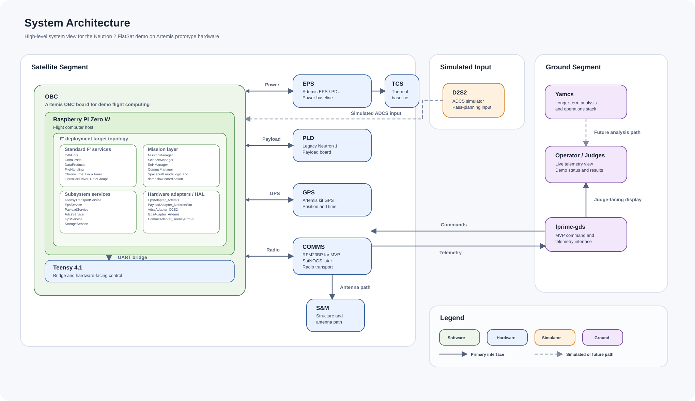
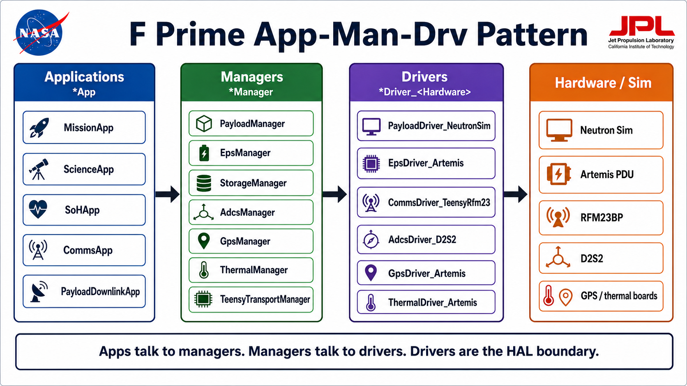

# System Architecture

## Purpose

This document is the working system-architecture crosswalk for the Neutron 2 FlatSat demo, written so future student developers can understand **the architecture, the decisions behind it, the tradeoffs, and the data-flow patterns** — not just the box diagram.

The important distinction is:

- `Neutron 2` is the target spacecraft architecture and subsystem model.
- `Artemis CubeSat` hardware is the prototype platform used to demonstrate that architecture during the current demo phase.

This means the demo is not a pure Artemis mission and not yet the full Neutron 2 spacecraft. It is a Neutron 2 subsystem story demonstrated on an Artemis-derived hardware stack.

## Source Context

This architecture summary is based on:

- the team's current FlatSat architecture diagrams
- repo documentation and current implementation state
- the user-provided Artemis CubeSat manual used as the prototype hardware reference

See [Reference Documents](#reference-documents) for the hardware manuals, datasheets, and ICDs that back the claims in this document. New to the terminology (SOH, CCSDS, APID, D2S2, OBC, PDU, HAL, ...)? Start with the [Glossary](GLOSSARY.md).

## Why F Prime (and why we refactored)

We did not start from nothing. The team already has **proven, working Artemis CubeSat flight software** — but it is **baremetal** and lives in [`external/epscorc3m`](../external/epscorc3m). That codebase flies, but it was **not flexible enough for Neutron 2**: subsystem logic, hardware drivers, and mission behavior are tightly coupled, so swapping a radio or payload, or changing mission modes, means invasive rewrites.

Neutron 2 needs to evolve hardware and mission behavior independently, so we refactored onto the **[F Prime (F´)](https://github.com/nasa/fprime) flight-software framework**:

- F´ is a NASA/JPL framework, flight-proven on real missions, with a strong component/port model that enforces separation between mission logic and hardware.
- Many other educational CubeSat teams use F´, so there is community knowledge, tutorials, and reusable framework services (`CdhCore`, `ComCcsds`, `DataProducts`, `FileHandling`, rate groups, drivers).
- The component model gives us a clean place to put a **Hardware Abstraction Layer** (see below), which is the key enabler for "build with the hardware we have now, swap in flight hardware later."

Keep `external/epscorc3m` as a reference for how the Artemis hardware actually behaves at the register/protocol level; do **not** copy its tightly-coupled architecture back into this repo.

## High-Level Architecture



## Subsystem Crosswalk

| Subsystem | Demo implementation | Role in the current prototype | Notes |
| --- | --- | --- | --- |
| `OBC` | Artemis OBC board using `Raspberry Pi` plus `Teensy 4.1` | Main flight-computing and interface layer | `Raspberry Pi` runs higher-level flight software. `Teensy` handles bridge/control duties and hardware-facing integration. |
| `EPS` | Artemis EPS / PDU / battery system | Real power-system baseline for the demo | Treat as the real EPS prototype, not a stub. PDU v2 protocol per the [PDU ICD](#reference-documents). |
| `ADCS` | `D2S2` simulator | Simulated ADCS behavior for the demo | The current demo does not require full physical flight ADCS implementation inside this repo. |
| `PLD` | `Neutron 2` payload **simulator** now, `Neutron 2` **development payload board** (loaned to us) later | Payload/science data source | Simulated payload data is acceptable for the demo. The adapter swaps to the loaned Neutron 2 dev board when it arrives, with no change to mission logic. |
| `COMMS` | `RFM23BP` for MVP, `SatNOGS` board as alternate/future path | Radio/transport subsystem | Default assumption is `RFM23BP` until the in-house `SatNOGS` board is validated. |
| `GPS` | Artemis kit GPS module | Position/time reference from installed Artemis hardware | Exact module may vary by kit configuration. |
| `S&M` | Artemis structure and antenna deployment baseline | Mechanical/structural context for the demo | Important for full-system understanding, but not the primary focus of current software work. |
| `TCS` | Artemis thermal baseline with sensors/heater context | Thermal and battery-heater context | Relevant to system understanding; currently a lower-priority software slice for the MVP demo. |

## Flight Software Architecture: Manager → Service → Adapter (HAL)

This is the most important pattern in the repository. Read it before touching components.



### The problem this solves

We have a demo coming up, but we **do not yet have the real flight hardware**. Today we only have the Artemis CubeSat Bus kit. We do **not** have:

- the SatNOGS comms board (we use the RFM23BP instead)
- the real Neutron 2 payload board (we use a simulator instead)
- the final/target EPS and other flight subsystems

We still need to build, demonstrate, and iterate now, then **swap in real hardware later without rewriting the mission**. The answer is a deliberate **Hardware Abstraction Layer (HAL)**, expressed in F´ as three component tiers. This is not a novel idea — it is classic layering — but it is the right fit for our "prototype now, fly later" constraint.

### The three tiers

1. **Managers** — *decide what happens next.* Mission and mode logic. They own the demo story (Base Mode → scheduled collection → science downlink) and coordinate subsystems. They talk **only to services**, never to hardware.
   - `MissionManager`, `ScienceManager`, `SoHManager`, `CommsManager`
2. **Services** — *subsystem logic + telemetry.* The stable, hardware-independent contract for each subsystem ("collect a payload sample," "command an EPS rail," "get GPS fix"). Services expose generic commands/telemetry to the managers and call down to an adapter for the actual hardware action.
   - `PayloadService`, `EpsService`, `AdcsService`, `GpsService`, `StorageService`, `TeensyTransportService`
3. **Adapters (the HAL)** — *hardware + protocol glue.* Each adapter implements one service's contract against one specific piece of hardware or simulator. This is the **only** tier that changes when hardware changes.
   - `PayloadAdapter_NeutronSim` (sim today → `PayloadAdapter_*` for the dev board later)
   - `EpsAdapter_Artemis` (Artemis PDU v2 protocol)
   - `AdcsAdapter_D2S2`, `GpsAdapter_Artemis`, `CommsAdapter_TeensyRfm23`

> **Mission talks to services. Services talk to adapters. Adapters talk to hardware.**

### Why this is worth it (the tradeoff)

- **Benefit:** when the loaned Neutron 2 payload board, the SatNOGS comms board, or the final EPS arrives, we write a **new adapter** and re-wire one connection in the topology. Managers and services are untouched, so the mission demo keeps working. We can develop against the hardware we have today and drop in flight hardware with no major refactor.
- **Cost:** more components and one extra indirection (manager → service → adapter) than a baremetal "just call the driver" approach. For a one-off baremetal demo this would be overkill — but for Neutron 2's "evolve hardware independently" requirement it pays for itself. This indirection is exactly the flexibility `external/epscorc3m` lacked.

### How to extend it (student recipe)

- New mission behavior → edit/add a **Manager**.
- New subsystem capability or telemetry contract → edit/add a **Service**.
- New or swapped hardware/sim → add an **Adapter**, keep the service contract identical, and re-wire it in `Top/topology.fpp`.
- If you find yourself putting hardware/protocol bytes in a manager or service, that logic belongs in an adapter.

## OBC Detail

The `OBC` is the most important subsystem for this repository.

### OBC hardware model

- `Raspberry Pi Zero W`
  - runs the primary flight-software application layer (the F´ deployment) for the demo
- `Teensy 4.1`
  - provides embedded control / bridge behavior around hardware and communications (UART mux relay, RFM23BP driver, local subsystem RPC)

### OBC software model in this repo

- `ArtemisRpiTeensy_N2`
  - active `F'` project and flight-software root (managers, services, adapters, topology)
- `ArtemisTeensy_N2_Baremetal`
  - satellite-side Teensy firmware (UART↔RF relay + local RPC)
- `GDS_Teensy`
  - ground-side Teensy firmware (RF↔USB triple-serial bridge)

### Important conceptual rule

Do not treat the current repo as if every Neutron 2 subsystem already exists in software.

Today, the codebase is strongest in:

- `OBC` transport and command/telemetry plumbing
- `COMMS` bridge behavior
- ground-link demonstration path

The broader subsystem architecture still matters, but several subsystem functions remain planned, simulated, or partially integrated. The HAL is what lets those slices firm up one adapter at a time.

## Transport Architecture: One UART, Three Channels

This section is the corrected, authoritative description of how bytes move between the Raspberry Pi, the satellite Teensy, the RF link, the ground Teensy, and the ground laptop. The single source of truth for the constants below is [`config/transport_constants.json`](../config/transport_constants.json).

### Why one UART

The satellite Raspberry Pi talks to the satellite Teensy over **one physical UART** (`115200 8N1` on the Pi's `/dev/serial0`). This is a **hardware constraint** of the current Artemis OBC board: the Pi has exactly one practical UART path to the Teensy. We are hardware-bounded here until a new OBC board exists, so rather than add wires we **software-multiplex** that one UART into virtual channels with `UartChannelMux` on the Pi side.

### The Pi-side UART frame wrapper

Every Pi↔Teensy UART frame is wrapped as:

```
0xD4 0xC3 | channel | len | payload (≤ 220 bytes) | crc16
```

(magic bytes `212 195`, `250 ms` frame timeout). The `channel` byte is what separates the three logical streams below.

### The three satellite UART channels

| Channel | Name | Contents | Crosses RF? |
| --- | --- | --- | --- |
| `0` | CCSDS / GDS | Raw F´/`fprime-gds` CCSDS command/event/telemetry bytestream | **Yes** |
| `1` | Payload | Payload/science data packet **sidecar**, chunk-sized for the RFM23BP packet budget (`N2` = `0x4E 0x32` magic, 35 data bytes/packet) | **Yes** |
| `2` | Teensy-local RPC | Satellite-Teensy-local subsystem RPC — PDU/EPS, GPS, etc. | **No** |

**Channel 2 is the one students most often misread.** It is *Remote Procedure Call* traffic between the F´ adapters on the Pi and the subsystem hardware that hangs off the **satellite Teensy's** local bus (e.g. the PDU/EPS over the Teensy's I²C/serial). The Teensy **consumes** channel 2 locally to actuate or read those boards; it is **not** forwarded over RF. The *results* (status, telemetry) can still be surfaced and logged through F´ events/telemetry on the ground — but the RPC bytes themselves never leave the satellite.

Only channels `0` and `1` cross the RF link (`rf_count = 2`); the satellite UART carries all three (`satellite_count = 3`).

### RF segmentation (Teensy ↔ Teensy)

The RFM23BP has a small packet budget, so each cross-RF channel is segmented:

- RF packet max `49` bytes, `5`-byte segment header, per-segment magic (`165` CCSDS / `166` payload).
- ACK/retry with `4` retries and `80 ms` ACK timeout; `500 ms` reassembly timeout; `8 ms` inter-segment gap.

See the [RFM23BP datasheet](#reference-documents) for the radio's packet/FIFO limits that drive these numbers.

### The three ground USB serial ports

The ground Teensy presents **three USB serial ports** to the ground laptop (Teensy USB triple-serial). 

> ⚠️ **Numbering warning:** the ground USB serial **port** index is *not* the same axis as the satellite UART **channel** index. Don't conflate "channel 2" (satellite-local RPC, never on RF) with "ground serial port 2" (payload receiver).

| Ground USB serial port | Purpose | Carries |
| --- | --- | --- |
| `0` (`Serial`) | `fprime-gds` command/event/telemetry port | RF channel 0 (CCSDS) |
| `1` (`SerialUSB1`) | **Debug** port — prints live UART+RF link counters so you can watch traffic and loss | diagnostics only |
| `2` (`SerialUSB2`) | **Payload receiver** tool port for `tools/payload_receiver.py` | RF channel 1 (payload) |

### End-to-end data paths

```text
Channel 0: fprime-gds command/events/telemetry
laptop fprime-gds  (ground USB serial port 0)
-> ground Teensy
-> ground RFM23BP  -> RF ->  satellite RFM23BP
-> satellite Teensy
-> Raspberry Pi /dev/serial0
-> UartChannelMux
-> F Prime ComCcsds  (and back the same way for uplink)

Channel 1: payload/science product bytes
F Prime PayloadDownlinkManager
-> UartChannelMux
-> satellite Teensy
-> RFM23BP RF link
-> ground Teensy  (ground USB serial port 2)
-> tools/payload_receiver.py
-> reconstructed .bin or .csv file
-> ground-station/neutron2-payload-viewer

Channel 2: satellite-local subsystem RPC (stays on the satellite)
F Prime adapter (e.g. EpsAdapter_Artemis)
-> UartChannelMux
-> satellite Teensy
-> local board bus (PDU/EPS, GPS, ...)
-> result returns as F Prime telemetry/events (not raw RF)
```

Important student-facing rule:

- `fprime-gds` is the command, event, telemetry, and progress screen (ground serial port 0).
- ground serial port 1 is a **read-only debug** view of link health.
- `tools/payload_receiver.py` is the file reconstruction tool for channel 1 (ground serial port 2).
- `ground-station/neutron2-payload-viewer` is the science review tool after a payload file exists. It can parse `.bin` payload products when the bytes inside are the Neutron 2 CSV format.

## The RF Link Constraint: How fprime-gds Talks Over a Walkie-Talkie

The single biggest constraint on this whole system is the **radio**. Understanding it explains almost every "why is the comms path built this strange way" question. The full investigation lives in [`docs/archive/RF_CHAIN_ROOT_CAUSE_ANALYSIS_2026-04-24.md`](archive/RF_CHAIN_ROOT_CAUSE_ANALYSIS_2026-04-24.md); this is the summary.

### What fprime-gds expects

`fprime-gds` is the ground tool. It speaks **CCSDS** — the spacecraft framing standard — using F´'s `space-packet-space-data-link` framing:

- The satellite emits fixed-size **TM (telemetry) transfer frames**; the ground emits **TC (telecommand) frames**.
- Each frame is **byte-exact and CRC-protected.** If a single byte is lost, inserted, or reordered, the frame's CRC fails, GDS prints `Checksum validation failed`, and the whole frame is discarded.
- Inside each frame are CCSDS space packets tagged by APID. GDS tracks a per-APID sequence count, so dropped packets surface as `APID n received sequence count ...` warnings.

So GDS does not want a "best-effort byte stream." It wants **whole, intact frames, in order.** That expectation is what collides with the radio.

### What the radio actually is

The RFM23BP is a **low-cost, ~50-byte-packet, half-duplex 433 MHz COTS packet radio — essentially a digital walkie-talkie.** It was never meant to be a clean modem for a byte-perfect framed protocol:

| Property | Reality | Consequence |
| --- | --- | --- |
| Max RF packet | ~49 bytes (44 useful after our 5-byte relay header) | A normal F´ frame does not fit in one packet |
| Duplex | Half-duplex — cannot transmit and receive at once | No free back-channel; ACKs compete with data |
| Reliability | Lossy under sustained traffic | One dropped segment can ruin an entire frame |
| Throughput | ~15 kB/s raw before overhead | Real file downlink is painfully slow |

### The collision, and the decisions we made

A byte-exact framed protocol meets a lossy walkie-talkie. Out of the box, F´ used `ComCfg.TmFrameFixedSize = 1024`, which is **~24 RF packets per frame** — lose any one of the 24 and the frame is dead. That is the core reason early downlink "did not work."

To make GDS comms work over this radio at all, we deliberately shrank and throttled everything:

- **Shrink the CCSDS frame:** `ComCfg.TmFrameFixedSize` 1024 → **128 bytes**, which is exactly **3 RF packets** (128 / 44 ≈ 3). A 3-strip frame can mostly survive the hop; a 24-strip frame cannot.
- **Shrink the buffers:** `FW_COM_BUFFER_MAX_SIZE = 96` and `FW_LOG_STRING_MAX_SIZE = 80` so packets and event strings fit the smaller frame. Tradeoff: long command arguments, long event strings, and stock file downlink can break — this is an MVP hack (see *Open Risks* in the RCA).
- **Throttle telemetry:** disable high-volume periodic subsystem telemetry. Keep `SOH` to a tiny heartbeat (a few integers, every 1–2 s). The radio cannot carry full subsystem telemetry without flooding and dropping frames.
- **Per-segment ACK/retry + partial-chunk dropping** in the Teensy relay (see [Transport Architecture](#transport-architecture-one-uart-three-channels)), so the 3 segments of a frame reassemble correctly and stale fragments never reach GDS.
- **Avoid stock F´ file downlink over RF.** Science data uses the custom, chunked **channel 1 payload sidecar** (35-byte payload packets) instead of the CCSDS TM path. This is why payload downlink is its own channel and not a normal F´ file transfer.

### What this means in practice

- ✅ Commands, command ACK, and a tiny `SOH` heartbeat are reliable enough for the live demo.
- ⚠️ Sustained full telemetry drops packets and produces APID sequence-count warnings.
- ❌ Large, byte-perfect file downlink over the CCSDS path is not realistic on this radio — that is what the channel 1 sidecar (now) and a better modem / SatNOGS board (later) are for.

This is exactly why the architecture treats **RFM23BP as the MVP comms path and a SatNOGS-style board as the real-downlink future path**, and why the Manager → Service → Adapter split matters: moving to a better radio is a new `CommsAdapter_*`, not a mission rewrite.

## RF MVP Config Overrides (a landmine to know about)

To survive the RFM23BP link, this deployment shrinks several **global F´ framework limits**. These are **project-local overrides** — *not* edits inside `lib/fprime` — which is the correct, update-safe way to do it. They live in:

- [`ArtemisRpiTeensyDeployment/RfMvpConfig/ComCfg.fpp`](../ArtemisRpiTeensy_N2/ArtemisRpiTeensyDeployment/RfMvpConfig/ComCfg.fpp)
- [`ArtemisRpiTeensyDeployment/RfMvpConfig/FpConstants.fpp`](../ArtemisRpiTeensy_N2/ArtemisRpiTeensyDeployment/RfMvpConfig/FpConstants.fpp)

and are wired into the build by `ArtemisRpiTeensyDeployment/CMakeLists.txt` (`add_fprime_subdirectory(.../RfMvpConfig/)`), which overrides the framework defaults in `lib/fprime/default/config/`.

The values that actually changed from the framework default:

| Constant | Framework default | RF MVP value | What it caps |
| --- | ---: | ---: | --- |
| `ComCfg.TmFrameFixedSize` | 1024 | **128** | CCSDS TM frame size → 3 RF packets instead of ~24 |
| `FW_COM_BUFFER_MAX_SIZE` | 512 | **96** | Every command / event / telemetry / param / file buffer |
| `FW_LOG_STRING_MAX_SIZE` | 200 | **80** | Maximum event (log) string length |

**Why this is a landmine:** these are *global* limits, so they silently constrain the **entire deployment**, not just the radio path. If you add a long event format string, a large command argument, a big telemetry struct, or try stock F´ file downlink and it mysteriously truncates or fails to fit, **check `RfMvpConfig/` first.** The numbers are deliberately tiny for the RF demo; raising them re-inflates CCSDS frames and makes the RF link *worse*. When the comms path moves to a better radio, revisit these values together with the framing. (This corrects an older note in the RCA that said these edits lived inside `lib/fprime`; they are now proper project-local overrides.)

## End-to-End Example: Tracing a Command and a Telemetry Channel

This section ties the component tiers and the transport together using **real instance and port names** from [`ArtemisRpiTeensyDeployment/Top/topology.fpp`](../ArtemisRpiTeensy_N2/ArtemisRpiTeensyDeployment/Top/topology.fpp). Follow `missionManager.PING` down and back.

### Uplink: a command from the ground to a handler

1. Operator runs `fprime-cli command-send ...missionManager.PING --arguments 4245` (or clicks it in the GDS GUI). `fprime-gds` serializes it as a CCSDS **TC** byte stream out ground USB serial port 0.
2. Ground Teensy → RF (channel 0) → satellite Teensy → Pi `/dev/serial0`.
3. On the Pi, `comDriver` (the `LinuxUartDriver`) receives bytes: `comDriver.$recv -> uartChannelMux.drvReceiveIn`.
4. `uartChannelMux` de-multiplexes channel 0 and passes CCSDS bytes up: `uartChannelMux.ccsdsRecvOut -> ComCcsds.comStub.drvReceiveIn`.
5. `ComCcsds` deframes the CCSDS frame/packet and routes the command: `ComCcsds.fprimeRouter.commandOut -> CdhCore.cmdDisp.seqCmdBuff`.
6. `CdhCore.cmdDisp` (the command dispatcher) matches the opcode and invokes the owning component — here `missionManager`'s `PING` command input port.
7. `MissionManager::PING_cmdHandler` runs: bumps `PingCount`, emits the `Pong` event, and replies `cmdResponse_out(... OK)`.
8. The response returns: `CdhCore.cmdDisp.seqCmdStatus -> ComCcsds.fprimeRouter.cmdResponseIn`, is framed, and goes back down channel 0 to GDS as the command ack.

### Downlink: a telemetry channel to the ground

1. A component writes a channel — e.g. `MissionManager::writeTelemetry()` calls the autocoded `tlmWrite_PingCount(...)`.
2. The telemetry path aggregates channels and emits CCSDS packets: `CdhCore.tlmSend.PktSend -> ComCcsds.comQueue.comPacketQueueIn[TELEMETRY]`.
3. `ComCcsds` frames it into a (128-byte) CCSDS **TM** frame: `ComCcsds.comStub.drvSendOut -> uartChannelMux.ccsdsSendIn`.
4. `uartChannelMux` wraps it on channel 0 and pushes it to the UART: `uartChannelMux.drvSendOut -> comDriver.$send`.
5. Pi → satellite Teensy → RF (segmented into 3 packets) → ground Teensy → ground USB serial port 0 → `fprime-gds` validates the frame CRC and updates the channel in the GUI.

Events follow the same downlink path via `CdhCore.events`; ground debug serial port 1 can watch the raw link counters while this happens. The **science/payload path is different** — it never touches `ComCcsds`/CCSDS; it uses `PayloadDownlinkManager` → channel 1 (see [Transport Architecture](#transport-architecture-one-uart-three-channels)).

### Where the HAL fits in this trace

`PING` is a pure C&DH loop, so it never touches an adapter. A *subsystem* command does: e.g. an EPS rail command flows `cmdDisp → epsService` (the stable contract) `→ epsAdapterArtemis` (PDU v2 over channel 2 RPC) `→ uartChannelMux` (channel 2) `→ satellite Teensy → PDU`. Same uplink plumbing; the service and adapter tiers are where subsystem-specific behavior lives. Swapping hardware swaps only the adapter.

## Key Demo Interfaces

These are the interfaces that matter most for the current demo architecture.

- `OBC <-> EPS`
  - control and telemetry relationship using the Artemis EPS/PDU baseline (channel 2 RPC → `EpsAdapter_Artemis`)
- `OBC <-> ADCS`
  - simulated through `D2S2`
- `OBC <-> PLD`
  - payload data / command path to the Neutron 2 payload simulator now, and the loaned Neutron 2 development payload board later (same `PayloadService` contract, swapped adapter)
- `OBC <-> COMMS`
  - `RFM23BP` now, `SatNOGS` if and when validated
- `OBC <-> GPS`
  - Artemis-provided GPS module
- `COMMS <-> Ground`
  - ground-station data path used by `fprime-gds` for the MVP demo

## Ground Segment

The ground side for this demo should be understood as a separate but essential part of the system:

- `D2S2`
  - external ADCS simulator
- `fprime-gds`
  - default MVP ground interface
- `Yamcs`
  - longer-term end-goal ground presentation / analysis environment
- operator-facing display
  - the live demo must make telemetry, command acknowledgement, payload-transfer progress, and science-data review visible

## D2S2: Orbit / Pass-Timing Simulator

`D2S2` ([dawndusk.space](https://dawndusk.space/)) is the external **orbit / pass-timing simulator** the demo uses in place of real orbital mechanics and a real ADCS sensor suite. We are on a bench, not in orbit, so D2S2 stands in for *"where is the spacecraft, and when is it over a ground station."*

Conceptually, D2S2 answers one question for the demo: **"are we approaching our orbit / contact window?"** That timing signal is what drives the mission story:

- D2S2 pass/timing information → a story service informs `MissionManager` → the spacecraft moves between **Base Mode** and **Science Collection** at the right moments.
- On the ground, the same D2S2 pass-planning inputs define the **mock contact window** used to stage the live demo: when the "pass" starts and how long it lasts.

In other words, D2S2 lets us rehearse the *timing* of a real pass — approach, contact, collect, downlink — without being in space. It is a simulator (orange in the [system diagram](#high-level-architecture)), not flight hardware; a real spacecraft would derive the same timing from GPS/ephemeris and ADCS. In the current topology the actual mission-mode transitions are emitted by `scienceManager` and `commsManager` into `missionManager.modeUpdateIn`; D2S2 provides the pass-timing premise those transitions are staged around.

## Demo Operating Story

This is the architecture-level story the software must support.

1. System boots into `Base Mode`.
2. Ground side uses `D2S2` pass assumptions to define the mock contact window.
3. During the pass, the satellite downlinks `SOH` / basic health telemetry.
4. Operator sends a command that schedules data collection after a short delay, such as `10` seconds.
5. The spacecraft performs a payload/data-collection action using a real or simulated payload source.
6. The system transitions into a science-data downlink path.
7. Ground software reconstructs, reviews, and presents the result.

## Payload Downlink Progress

For the MVP path, F Prime does not use stock GDS file downlink for the science product. Instead, the mission command path starts a custom channel 1 payload transfer designed for the RFM23BP link.

Runtime ownership is:

- `PayloadAdapter_NeutronSim` (or a future real Neutron 2 payload-board adapter) produces payload bytes.
- `StorageService` tracks the latest science product.
- `CommsManager.REQUEST_SCIENCE_DOWNLINK` requests downlink of the latest stored product.
- `PayloadDownlinkManager` packetizes the product, sends channel 1 packets, and emits progress events.
- `tools/payload_receiver.py` reconstructs bytes, requests retries for missing packets, verifies CRC, and writes the output file.
- The payload viewer opens the reconstructed file and parses neutron-count CSV content.

`PayloadDownlinkManager.PayloadDownlinkProgress` emits nominal `10%` increments from `10` through `90`. `PayloadDownlinkComplete` and `CommsManager.DownlinkFinished` are the completion signals. For tiny payloads, several progress events may appear at the same timestamp or packet count because one payload packet can represent more than ten percent of the file.

## Development Assumptions

Unless the user says otherwise, agents should assume the following:

- `RFM23BP` is the default communications path for the MVP demo.
- `SatNOGS` is an alternate or future communications path, not the default assumption.
- `D2S2` provides simulated `ADCS` behavior.
- The payload source is the **Neutron 2 payload simulator**, with the loaned **Neutron 2 development payload board** as the future real source; simulation is acceptable until the dev board is integrated and stable.
- `fprime-gds` is the ground-tool default for the MVP demonstration.
- `Yamcs` is a longer-term target, not the current required ground stack.

## EPS/PDU Boundary Note

For the MVP, the EPS service and Artemis PDU adapter boundary is intentionally pragmatic. The new PDU is planned for F Prime-driven testing, so some PDU-shaped diagnostics and rail semantics may appear near the EPS service while the ICD settles.

This is acceptable when:

- mission operators see generic EPS/rail commands rather than raw PDU packets
- `EpsAdapter_Artemis` owns the PDU v2 protocol and channel 2 local RPC details
- HIL notes clearly say when behavior is real PDU response versus local emulation

If the PDU grows into a fuller subsystem contract, refactor the adapter/service split then. The MVP priority is an understandable, reproducible EPS path that can exercise the real PDU through F Prime. See the [PDU Protocol ICD](#reference-documents) for the wire format.

## Reference Documents

Authoritative hardware/protocol references that back this architecture. Read these when you need ground truth instead of a summary.

- **Artemis CubeSat User's Manual (April 2026)** — prototype hardware reference (OBC, EPS, GPS, structure). The repo file [`docs/Artemis User's Manual - April 2026.txt`](<Artemis User's Manual - April 2026.txt>) is a **local snapshot**; the full, up-to-date manual is the public Google Doc: <https://docs.google.com/document/d/1rWuh5gqnNprtgiNfhd3HfEG-Midq0QqxDkGm_KqfT8Y/edit?tab=t.0>
- **RFM23BP datasheet** — radio packet/FIFO limits that drive the RF segmentation budget. The repo file [`docs/rfm23bp/RFM23BP_datasheet.txt`](rfm23bp/RFM23BP_datasheet.txt) is a **local copy**; the online datasheet is: <https://www.hoperf.com/uploads/RFM23BPdatasheet_1695351296.pdf>
- **RF chain root-cause analysis** — why the RF link forced the 128-byte frame and telemetry throttling decisions: [`docs/archive/RF_CHAIN_ROOT_CAUSE_ANALYSIS_2026-04-24.md`](archive/RF_CHAIN_ROOT_CAUSE_ANALYSIS_2026-04-24.md)
- **Artemis PDU Protocol ICD** — PDU v2 command/telemetry wire format used by `EpsAdapter_Artemis` over channel 2: [`external/artemis-pdu/PDU_PROTOCOL_ICD.md`](../external/artemis-pdu/PDU_PROTOCOL_ICD.md) ([PDF](../external/artemis-pdu/docs/PDU_PROTOCOL_ICD.pdf))
- **Proven baremetal reference** — the prior working Artemis flight software we refactored away from: [`external/epscorc3m`](../external/epscorc3m)
- **Transport constants (source of truth)** — channel IDs, frame wrapper, RF/payload sizing: [`config/transport_constants.json`](../config/transport_constants.json)

Companion docs for newcomers:

- **Glossary** — every acronym and term used across the repo: [`docs/GLOSSARY.md`](GLOSSARY.md)
- **Hardware port map & power bring-up** — which USB device is which, and how to power the bench safely: [`docs/HARDWARE_PORT_MAP_AND_POWER.md`](HARDWARE_PORT_MAP_AND_POWER.md)
- **Time & scheduling** — how rate groups, the clock, and the "collect in N seconds" countdown work: [`docs/TIME_AND_SCHEDULING.md`](TIME_AND_SCHEDULING.md)
- **F´ ground interfaces primer** — commands, events, telemetry, and parameters, and how to add each: [`docs/FPRIME_GROUND_INTERFACES_PRIMER.md`](FPRIME_GROUND_INTERFACES_PRIMER.md)

## Agent Guidance

Read this document before making architecture claims, subsystem plans, or demo-flow decisions.

In particular, do not:

- confuse Artemis hardware with the full Neutron 2 production architecture
- assume every subsystem in the architecture already has matching implementation in the repo
- put hardware/protocol details into managers or services — that belongs in an adapter
- optimize for generic CubeSat completeness when the actual goal is the Neutron 2 demo story on Artemis prototype hardware

Instead, use this rule:

- preserve the Neutron 2 subsystem architecture in planning and naming
- keep the Manager → Service → Adapter layering intact so hardware can be swapped later
- use Artemis hardware reality as the implementation constraint for the current demo
