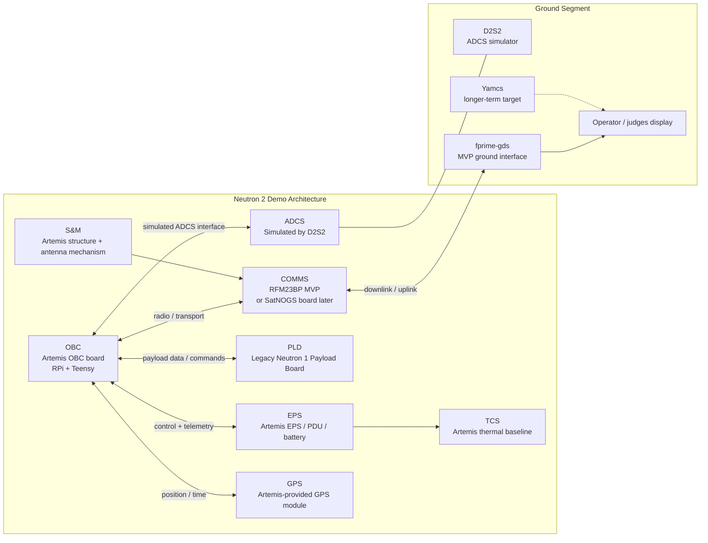

# System Architecture

## Purpose

This document is the working system-architecture crosswalk for the Neutron 2 FlatSat demo.

The important distinction is:

- `Neutron 2` is the target spacecraft architecture and subsystem model.
- `Artemis CubeSat` hardware is the prototype platform used to demonstrate that architecture during the current demo phase.

This means the demo is not a pure Artemis mission and not yet the full Neutron 2 spacecraft. It is a Neutron 2 subsystem story demonstrated on an Artemis-derived hardware stack.

## Source Context

This architecture summary is based on:

- the team’s current FlatSat architecture diagrams
- repo documentation and current implementation state
- the user-provided Artemis CubeSat manual used as the prototype hardware reference

## High-Level Architecture



## Subsystem Crosswalk

| Subsystem | Demo implementation | Role in the current prototype | Notes |
| --- | --- | --- | --- |
| `OBC` | Artemis OBC board using `Raspberry Pi` plus `Teensy 4.1` | Main flight-computing and interface layer | `Raspberry Pi` runs higher-level flight software. `Teensy` handles bridge/control duties and hardware-facing integration. |
| `EPS` | Artemis EPS / PDU / battery system | Real power-system baseline for the demo | Treat as the real EPS prototype, not a stub. |
| `ADCS` | `D2S2` simulator | Simulated ADCS behavior for the demo | The current demo does not require full physical flight ADCS implementation inside this repo. |
| `PLD` | Legacy `Neutron 1 Payload Board` | Real payload-side demo source under test | Payload integration is based on the legacy board and its ICD. |
| `COMMS` | `RFM23BP` for MVP, `SatNOGS` board as alternate/future path | Radio/transport subsystem | Default assumption is `RFM23BP` until the in-house `SatNOGS` board is validated. |
| `GPS` | Artemis kit GPS module | Position/time reference from installed Artemis hardware | Exact module may vary by kit configuration. |
| `S&M` | Artemis structure and antenna deployment baseline | Mechanical/structural context for the demo | Important for full-system understanding, but not the primary focus of current software work. |
| `TCS` | Artemis thermal baseline with sensors/heater context | Thermal and battery-heater context | Relevant to system understanding; currently a lower-priority software slice for the MVP demo. |

## OBC Detail

The `OBC` is the most important subsystem for this repository.

### OBC hardware model

- `Raspberry Pi Zero W`
  - runs the primary flight-software application layer for the demo
- `Teensy 4.1`
  - provides embedded control / bridge behavior around hardware and communications

### OBC software model in this repo

- `ArtemisRpiTeensy_N2`
  - active `F'` project and flight-software root
- `ArtemisTeensy_N2_Baremetal`
  - satellite-side Teensy firmware
- `GDS_Teensy`
  - ground-side Teensy firmware

### Important conceptual rule

Do not treat the current repo as if every Neutron 2 subsystem already exists in software.

Today, the codebase is strongest in:

- `OBC` transport and command/telemetry plumbing
- `COMMS` bridge behavior
- ground-link demonstration path

The broader subsystem architecture still matters, but several subsystem functions remain planned, simulated, or partially integrated.

## Key Demo Interfaces

These are the interfaces that matter most for the current demo architecture.

- `OBC <-> EPS`
  - control and telemetry relationship using the Artemis EPS/PDU baseline
- `OBC <-> ADCS`
  - simulated through `D2S2`
- `OBC <-> PLD`
  - payload data / command path to the legacy `Neutron 1 Payload Board`
- `OBC <-> COMMS`
  - `RFM23BP` now, `SatNOGS` if and when validated
- `OBC <-> GPS`
  - Artemis-provided GPS module
- `COMMS <-> Ground`
  - ground-station data path used by `fprime-gds` for the MVP demo

## Ground Segment

The ground side for this demo should be understood as a separate but essential part of the system:

- `D2S2`
  - external ADCS simulator
- `fprime-gds`
  - default MVP ground interface
- `Yamcs`
  - longer-term end-goal ground presentation / analysis environment
- operator-facing display
  - the live demo must make telemetry, command acknowledgement, payload-transfer progress, and science-data review visible

## Demo Operating Story

This is the architecture-level story the software must support.

1. System boots into `Base Mode`.
2. Ground side uses `D2S2` pass assumptions to define the mock contact window.
3. During the pass, the satellite downlinks `SOH` / basic health telemetry.
4. Operator sends a command that schedules data collection after a short delay, such as `10` seconds.
5. The spacecraft performs a payload/data-collection action using a real or simulated payload source.
6. The system transitions into a science-data downlink path.
7. Ground software reconstructs, reviews, and presents the result.

## Current HIL Data Path

The current hardware-in-the-loop demo uses one RF chain, but it separates
different data classes by logical channel.

```text
Channel 0: fprime-gds command/events/telemetry
Mac fprime-gds
-> ground Teensy Serial data port
-> ground RFM23BP
-> satellite RFM23BP
-> satellite Teensy
-> Raspberry Pi /dev/serial0
-> UartChannelMux
-> F Prime ComCcsds

Channel 1: payload/science product bytes
F Prime PayloadDownlinkManager
-> UartChannelMux
-> satellite Teensy
-> RFM23BP RF link
-> ground Teensy payload serial port
-> tools/payload_receiver.py
-> reconstructed .bin or .csv file
-> ground-station/neutron2-payload-viewer

Channel 2: satellite-local subsystem RPC
F Prime adapter
-> UartChannelMux
-> satellite Teensy
-> local board bus such as PDU/EPS
```

Important student-facing rule:

- `fprime-gds` is the command, event, telemetry, and progress screen.
- `tools/payload_receiver.py` is the file reconstruction tool for channel 1.
- `ground-station/neutron2-payload-viewer` is the science review tool after a
  payload file exists.
- The viewer can parse `.bin` payload products when the bytes inside are the
  Neutron 2 CSV format.

## Payload Downlink Progress

For the MVP path, F Prime does not use stock GDS file downlink for the science
product. Instead, the mission command path starts a custom channel 1 payload
transfer designed for the RFM23BP link.

Runtime ownership is:

- `PayloadAdapter_NeutronSim` or a future real payload adapter produces payload
  bytes.
- `StorageService` tracks the latest science product.
- `CommsManager.REQUEST_SCIENCE_DOWNLINK` requests downlink of the latest stored
  product.
- `PayloadDownlinkManager` packetizes the product, sends channel 1 packets, and
  emits progress events.
- `tools/payload_receiver.py` reconstructs bytes, requests retries for missing
  packets, verifies CRC, and writes the output file.
- The payload viewer opens the reconstructed file and parses neutron-count CSV
  content.

`PayloadDownlinkManager.PayloadDownlinkProgress` emits nominal `10%` increments
from `10` through `90`. `PayloadDownlinkComplete` and
`CommsManager.DownlinkFinished` are the completion signals. For tiny payloads,
several progress events may appear at the same timestamp or packet count because
one payload packet can represent more than ten percent of the file.

## Development Assumptions

Unless the user says otherwise, agents should assume the following:

- `RFM23BP` is the default communications path for the MVP demo.
- `SatNOGS` is an alternate or future communications path, not the default assumption.
- `D2S2` provides simulated `ADCS` behavior.
- The payload source is the legacy `Neutron 1 Payload Board`, with simulation allowed if integration is not stable enough for the demo.
- `fprime-gds` is the ground-tool default for the MVP demonstration.
- `Yamcs` is a longer-term target, not the current required ground stack.

## EPS/PDU Boundary Note

For the MVP, the EPS service and Artemis PDU adapter boundary is intentionally
pragmatic. The new PDU is planned for F Prime-driven testing, so some
PDU-shaped diagnostics and rail semantics may appear near the EPS service while
the ICD settles.

This is acceptable when:

- mission operators see generic EPS/rail commands rather than raw PDU packets
- `EpsAdapter_Artemis` owns the PDU v2 protocol and channel 2 local RPC details
- HIL notes clearly say when behavior is real PDU response versus local
  emulation

If the PDU grows into a fuller subsystem contract, refactor the adapter/service
split then. The MVP priority is an understandable, reproducible EPS path that
can exercise the real PDU through F Prime.

## Agent Guidance

Read this document before making architecture claims, subsystem plans, or demo-flow decisions.

In particular, do not:

- confuse Artemis hardware with the full Neutron 2 production architecture
- assume every subsystem in the architecture already has matching implementation in the repo
- optimize for generic CubeSat completeness when the actual goal is the Neutron 2 demo story on Artemis prototype hardware

Instead, use this rule:

- preserve the Neutron 2 subsystem architecture in planning and naming
- use Artemis hardware reality as the implementation constraint for the current demo
